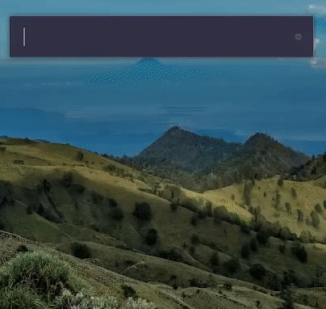

# Ulauncher - Prayer Times


## Description

This extension allows you to get prayer times for your location. This extension uses Presendency of Religious Affairs of Turkey's website to get prayer times.

Actually Presendency of Religious Affairs of Turkey's has official API for getting prayer times. But this API only allows 5 request per day. And requires authentication. So I decided to use their website to get prayer times with web scraping method.

## Demo



## Requirements

- [Ulauncher](https://ulauncher.io/)
- [Python >= 3](https://www.python.org/)
- PIP Requirements:
    - [bs4](https://pypi.org/project/beautifulsoup4/)
    - [retrying](https://pypi.org/project/retrying/)

## Install

Open ulauncher preferences window -> extensions -> add extension and paste the following url:

```
https://github.com/muhammedzahit/ulauncher-prayer-app
```

In extension preferences, you can set your location. Generally location is COUNTRY/CITY/PROVINCE or COUNTRY/CITY. For example: FRANCE/PARIS or TÜRKİYE/SAMSUN/ÇARŞAMBA

If you dont set your location, you can look up [sorted_cities.txt](https://github.com/muhammedzahit/ulauncher-prayer-app/blob/main/sorted_cities.txt) file and find your location. Then you can set Text ID or Numeric ID of your location.

## Usage

- Open ulauncher and type `prayer` or keyword that you set.
